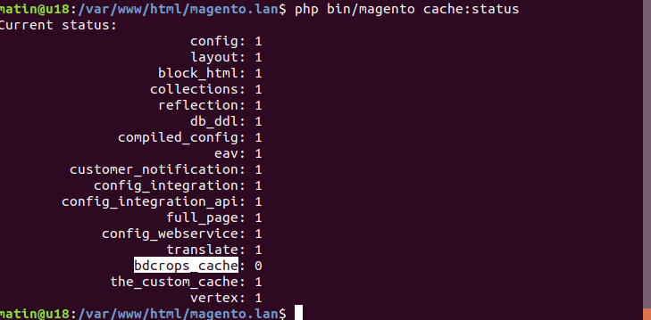
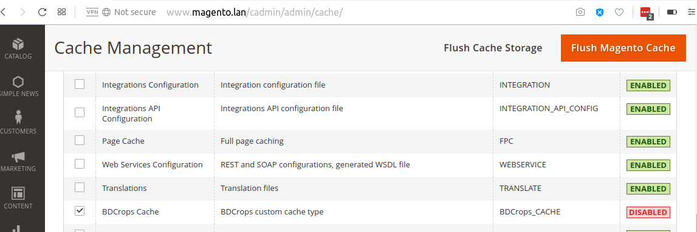

# BDC_CacheType

This module is used as creating a new cache type Magento 2 extensions.
A cache type enables you to specify what is cached and enables merchants to clear that cache type using the Cache Management page in the Magento Admin.

One of the key things is to use Magento cache in a way that we can cache our rendered content on the frontend and flush only the specific blocks if needed. A custom cache type therefore enables us to specify what is cached and enables our clients to clear that specific cache type using the Cache Management option in the Administration.


## Creating a new cache type in Magento is as easy as doing the following

- Create app/code/BDC/CacheType/registration.php & insert below Code:
```
<?php
\Magento\Framework\Component\ComponentRegistrar::register(
    \Magento\Framework\Component\ComponentRegistrar::MODULE,
    'BDC_CacheType',
    __DIR__
);

```
- Create app/code/BDC/CacheType/etc/module.xml
```
<?xml version="1.0"?>
<config xmlns:xsi="http://www.w3.org/2001/XMLSchema-instance" xsi:noNamespaceSchemaLocation="urn:magento:framework:Module/etc/module.xsd">
    <module name="BDC_CacheType" setup_version="1.0.0"/>
</config>

```
- Create app/code/BDC/CacheType/etc/cache.xml

```
<?xml version="1.0"?>

<config xmlns:xsi="http://www.w3.org/2001/XMLSchema-instance" xsi:noNamespaceSchemaLocation="urn:magento:framework:Cache/etc/cache.xsd">
    <type name="bdcrops_cache" translate="label,description" instance="BDC\CacheType\Model\Cache\BDCropsCache">
        <label>BDCrops Cache</label>
        <description>BDCrops custom cache type</description>
    </type>
</config>

```

- Create app/code/BDC/CacheType/Model/Cache/BDCropsCache.php
```
<?php

namespace BDC\CacheType\Model\Cache;

class BDCropsCache extends \Magento\Framework\Cache\Frontend\Decorator\TagScope
{
    const TYPE_IDENTIFIER = 'bdcrops_cache';
    const CACHE_TAG = 'BDCrops_CACHE';

    public function __construct(\Magento\Framework\App\Cache\Type\FrontendPool $cacheFrontendPool) {
        parent::__construct($cacheFrontendPool->get(self::TYPE_IDENTIFIER), self::CACHE_TAG);
    }
}

```
- Active Module, Clean & Test CLI & Admin
```
php bin/magento setup:upgrade
php bin/magento cache:flush
php bin/magento cache:status
php bin/magento cache:enable

```


CLI:

Admin:


- To  use New  Cache Type:
To use this new cache type, you will need a helper file. This helper generates hash from cache ID and loads/saves content that depends on the cache ID

Create app/code/BDC/CacheType/Helper/Cache.php
```
<?php
namespace BDC\CacheType\Helper;

use Magento\Framework\App\Helper;

class Cache extends Helper\AbstractHelper {
    const CACHE_TAG = 'bdcrops_cache';
    const CACHE_ID = 'megamenu';
    const CACHE_LIFETIME = 86400;

    protected $cache;
    protected $cacheState;
    protected $storeManager;
    private $storeId;

    /**
     * Cache constructor.
     * @param Helper\Context $context
     * @param \Magento\Framework\App\Cache $cache
     * @param \Magento\Framework\App\Cache\State $cacheState
     * @param \Magento\Store\Model\StoreManagerInterface $storeManager
     */
    public function __construct(
        Helper\Context $context,
        \Magento\Framework\App\Cache $cache,
        \Magento\Framework\App\Cache\State $cacheState,
        \Magento\Store\Model\StoreManagerInterface $storeManager ) {
        $this->cache = $cache;
        $this->cacheState = $cacheState;
        $this->storeManager = $storeManager;
        $this->storeId = $storeManager->getStore()->getId();
        parent::__construct($context);
    }

    /**
     * @param $method
     * @param array $vars
     * @return string
     */
    public function getId($method, $vars = array()) {
        return base64_encode($this->storeId . self::CACHE_ID . $method . implode('', $vars));
    }

    /**
     * @param $cacheId
     * @return bool|string
     */
    public function load($cacheId){
        if ($this->cacheState->isEnabled(self::CACHE_ID)) {
            return $this->cache->load($cacheId);
        }

        return FALSE;
    }

    /**
     * @param $data
     * @param $cacheId
     * @param int $cacheLifetime
     * @return bool
     */
    public function save($data, $cacheId, $cacheLifetime = self::CACHE_LIFETIME){
        if ($this->cacheState->isEnabled(self::CACHE_ID)) {
            $this->cache->save($data, $cacheId, array(self::CACHE_TAG), $cacheLifetime);
            return TRUE;
        }
        return FALSE;
    }
}

```
